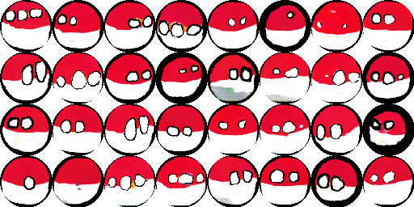

# Conditional Wasserstein's Generative Adversarial Network with Gradient Penalty for generating Polandball characters

## Made by Mateusz Kolinski MateuszPKolinski@gmail.com in 2022

### Abstract (English)

The main goal of this project was to develop a method using neural networks that would allow for the automatic generation of characters from Polandball comics. A GAN (Generative Adversarial Network) was created to achieve this goal, which is a set of two networks, generator and discriminator, which compete against each other during the learning process. An important aspect of the project was to add the possibility of generating a specific type of character, which is possible with a CGAN (Conditional GAN). This work also includes parts of WGAN-GP (Wasserstein’s GAN with Gradient Penalty) to improve the stability of the learning process.

The project was made in Python using the PyTorch library. The training image set was a public data set of 61335 images. It was modified to eliminate unrepresentative characters and amounts to 37930 images. Then it was augmented due to the small number of characters in many classes and consists of 71539 images.

To speed up the training process, the transparency channel has been removed from the training images. It is added at the very end by applying a mask and cutting out a circle inscribed in the square of an image.

In order to determine the network architecture that allows the most faithful representation of the images from the training set, nearly 30 network models using various parameters were trained. As a result, a neural network was obtained, the generated images of which achieve an average FID (Frechet Inception Distance) factor of 149 for 194 character classes.

The main limitation of the project is the small number of characters representing many of the character classes. This results in a visual deterioration of the generated images. The classes of overrepresented balls achieve mean FID values of around 100, while those with sparse representation often exceed 180.

The end result of the project are images of Polandball characters generated by the GAN network, which can then be used to create comic book panels.

### Choosing the best generator iteration based on Frechet Inception Distance

Generator states were saved every 10 epochs. To assess the quality of the generated images from such a vast dataset, I used the Fréchet Inception Distance (FID). This metric compares the distributions of two datasets by computing the Fréchet distance between gaussian functions fitted to their feature representations in an Inception-based convolutional neural network. To save computation time, FID was calculated for each class from only 32 generated images of that class. This leaves a lot of room for improvement in the future versions. FID was then averaged for all classes every 10 epochs. From that data, a graph was plotted which determined the best generator state - the one with lowest FID.

### Results for chosen classes

Classes have been chosen based on a suspected difficulty generationg them (eg. how many details their flags have) and the size of input data of selected class. The velow image is a direct screenshot from the thesis.

As suspected, the generated neural network has a relatively easy time generating characters when their flags are simple and their input data for that class was sizeable. Poland, Czech Republic, Austria, and Austrian Imperium are generated almost perfectly, whereas character of Togo, both a hard character and with little input, still needs some work. 

Please bear in mind that the whole idea of this comic is to be drawn sloppily by hand - without any usage of even the simplest Paint tools. As such, many images from the input database are vaguely circular at best. The grotesque mockery is often intended too. The best example of this is Poland's character, who has their colors swapped. This notion carries strongly onto characters with more details in their flags. Ball of European Union from the input dataset often has fluctuating number of stars. Sometimes they aren't even stars. All those mentioned issues make training such neural network tricky, but also leave an impact on the final results. To reiterate - final results are meant to be messy, sloppy and grotesque just as the input data is.
